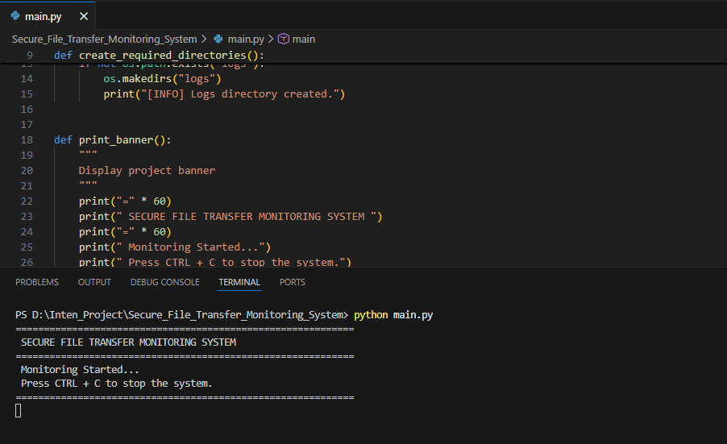
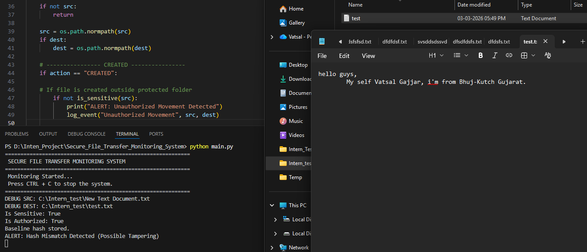
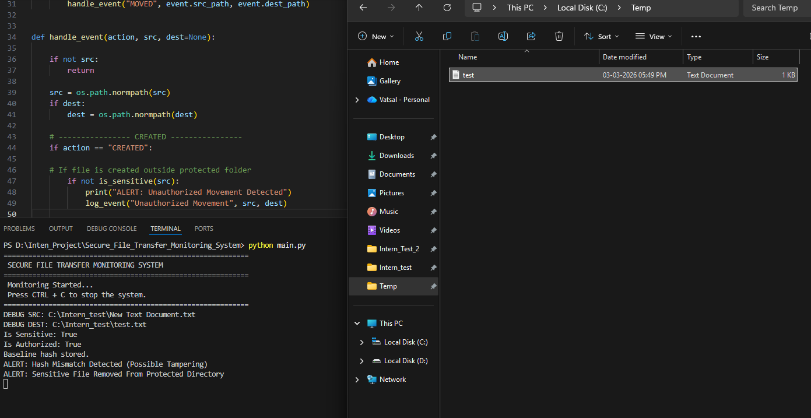
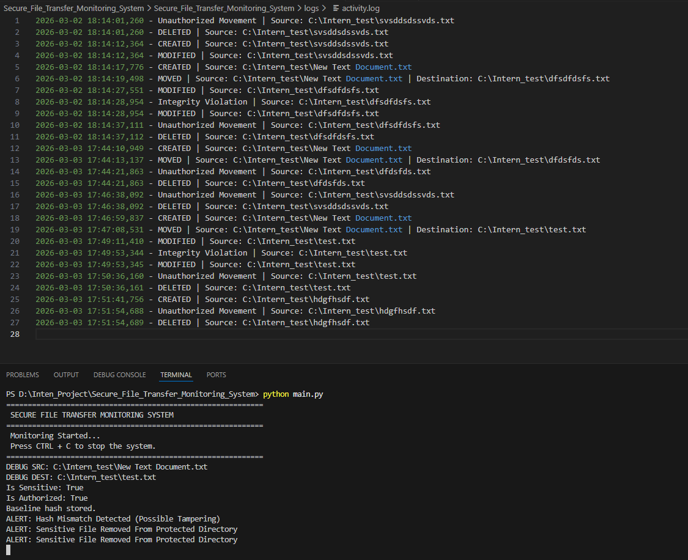
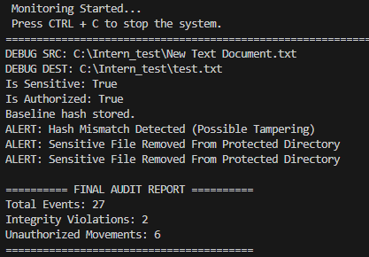

# 🔐 Secure File Transfer Monitoring System

A Python-based **real-time file monitoring system** that detects:

* Unauthorized file movement
* File tampering (hash mismatch)
* Sensitive file deletion
* Suspicious file activities

This project simulates a **Data Loss Prevention (DLP)** and **Blue Team security monitoring tool**.

---

# 📌 Features

✔ Real-time file monitoring
✔ Detect file tampering using SHA256 hashing
✔ Detect unauthorized file movement
✔ Detect sensitive file deletion
✔ Maintain activity logs
✔ Generate final audit security report

---

# 🛠 Technologies Used

* Python
* Watchdog (File system monitoring)
* Hashlib (File hashing)
* Logging module
* Windows File System

---

# 📂 Project Structure

```
Secure_File_Transfer_Monitoring_System
│
├── main.py
├── config.py
│
├── monitor
│   ├── file_monitor.py
│   └── event_handler.py
│
├── security
│   ├── hashing.py
│   ├── sensitive_check.py
│   ├── authorization.py
│   └── hash_store.py
│
├── utils
│   ├── logger.py
│   └── report_generator.py
│
├── logs
│   └── activity.log
│
└── screenshots
```

---

# ⚙️ Installation

### 1️⃣ Clone Repository

```
git clone https://github.com/yourusername/Secure_File_Transfer_Monitoring_System.git
cd Secure_File_Transfer_Monitoring_System
```

### 2️⃣ Install Dependencies

```
pip install watchdog
```

---

# ▶️ Run the Project

```
python main.py
```

Output:

```
SECURE FILE TRANSFER MONITORING SYSTEM
Monitoring Started...
Press CTRL + C to stop the system.
```

---

# 🔎 System Workflow

1️⃣ Monitor file system events

* Create
* Modify
* Delete
* Move

2️⃣ Check if file is sensitive

3️⃣ Generate SHA256 hash

4️⃣ Detect tampering

5️⃣ Detect unauthorized movement

6️⃣ Log events

7️⃣ Generate final audit report

---

# ⚠️ Tampering Detection

When a sensitive file is modified:

```
ALERT: Hash Mismatch Detected (Possible Tampering)
```

This means the file content changed unexpectedly.

---

# 🚨 Unauthorized Movement Detection

If a sensitive file is moved outside the protected directory:

```
ALERT: Unauthorized Movement Detected
```

---

# 🖼 Screenshots

### Monitoring System Running



---

### Tampering Detection



---

### Unauthorized Movement



---

### Activity Logs



---

### Final Audit Report



---

# 📚 Learning Outcomes

This project demonstrates:

* File system monitoring
* Hash based integrity checking
* Security event logging
* Insider threat detection
* Data Loss Prevention (DLP)

